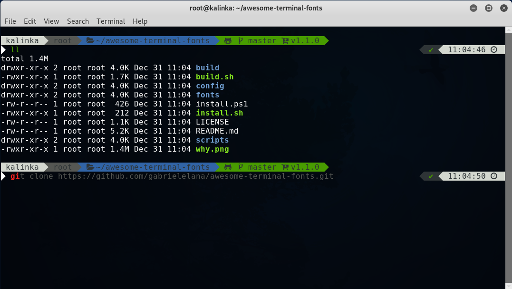

# Better Terminal Experience - Oh-My-Zsh + Bira Theme + Autosuggestions



## MacOS Installation with iTerm2 and Homebrew

First of all we need to install [**Homebrew**](https://brew.sh/)

```bash
/usr/bin/ruby -e "$(curl -fsSL https://raw.githubusercontent.com/Homebrew/install/master/install)"
```

This will install all the necessary requirements:

```bash
brew tap homebrew/cask-fonts
brew install zsh-autosuggestions zsh-syntax-highlighting git wget zsh
brew cask install iterm2 font-firacode-nerd-font
```

Install [**Oh-My-Zsh**](https://github.com/robbyrussell/oh-my-zsh)

```bash
sh -c "$(wget https://raw.githubusercontent.com/robbyrussell/oh-my-zsh/master/tools/install.sh -O -)"
```

### ~/.zshrc Config Modifications for MacOS

Set theme and fonts:

```bash
ZSH_THEME="bira"
```

Add this to the the end of ~/.zshrc

```bash
## Shell Integration and plugins
source /usr/local/share/zsh-syntax-highlighting/zsh-syntax-highlighting.zsh
source /usr/local/share/zsh-autosuggestions/zsh-autosuggestions.zsh
## Fix for Slow zsh-autosuggestions copy&paste
autoload -Uz bracketed-paste-magic
zle -N bracketed-paste bracketed-paste-magic
zstyle ':bracketed-paste-magic' active-widgets '.self-*'
```

## Linux Installation

Requirements:

```bash
git zsh wget
```

Install [**Oh-My-Zsh**](https://github.com/robbyrussell/oh-my-zsh)

```bash
sh -c "$(wget https://raw.githubusercontent.com/robbyrussell/oh-my-zsh/master/tools/install.sh -O -)"
```

Install Autosuggestions, Syntax-Highlighting Plugins

```bash
git clone https://github.com/zsh-users/zsh-autosuggestions ${ZSH_CUSTOM:-~/.oh-my-zsh/custom}/plugins/zsh-autosuggestions

git clone https://github.com/zsh-users/zsh-syntax-highlighting.git ${ZSH_CUSTOM:-~/.oh-my-zsh/custom}/plugins/zsh-syntax-highlighting
```

### ~/.zshrc Config Modifications for Linux

Set theme and fonts:

```bash
ZSH_THEME="bira"
```

Activate the plugins

```bash
plugins=(
  git
  zsh-autosuggestions
  zsh-syntax-highlighting
)
```

Add this to the the end of ~/.zshrc

```bash

## Fix for Slow zsh-autosuggestions copy&paste
autoload -Uz bracketed-paste-magic
zle -N bracketed-paste bracketed-paste-magic
zstyle ':bracketed-paste-magic' active-widgets '.self-*'
```
