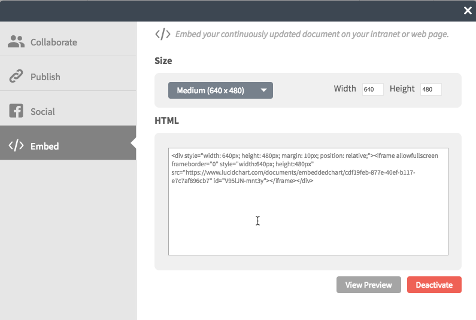

title: Markdown CheatSheet For MkDocs - Lucid Charts Embedding
description: Markdown cheatSheet for MkDocs. Lucid Charts Embedding examples and simple usage

# Lucid Charts Embedding

[lucidchart.com](https://www.lucidchart.com/ "lucidchart.com")

open the Lucid chart and select the share -> embed menu item. click the `activate embed code` and copy and past the HTML.



> :bulb: its recomended to change the width to 100% and remove the margin and relative setting under style

```html
<div style="width: 100%; height: 520px;">  
<iframe allowfullscreen frameborder="0"
style="width:100%; height:520px"
src="https://www.lucidchart.com/documents/embeddedchart/ee9393c4-427d-4390-97da-1d0a42b5823e"
id="n8kd1lbHuhin">
</iframe>
</div>
```

<div style="width: 100%; height: 600px;">
<iframe allowfullscreen frameborder="0" style="width:100%; height:600px" src="https://www.lucidchart.com/documents/embeddedchart/ee9393c4-427d-4390-97da-1d0a42b5823e"
id="n8kd1lbHuhin"></iframe>
</div>

<!-- Donation Button -->
<form action="https://www.paypal.com/cgi-bin/webscr" method="post" target="_top" align="center"><input type="hidden" name="cmd" value="_s-xclick"><input type="hidden" name="hosted_button_id" value="Q94AU5RUD4X6A"><input type="image" src="https://raw.githubusercontent.com/fire1ce/3os.org/gh-pages/assets/images/beerDonation.png" width="220px" border="0" name="submit" alt="PayPal - The safer, easier way to pay online!"></form>
<!-- Donation Button -->