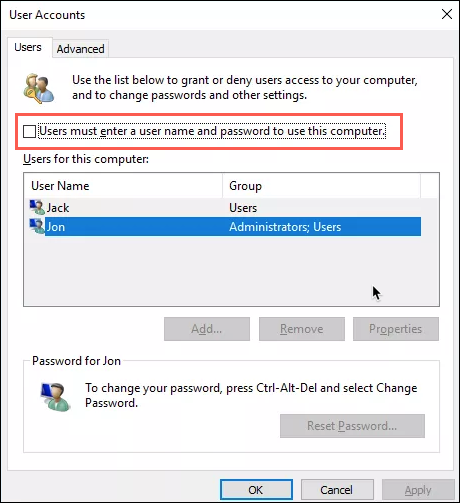
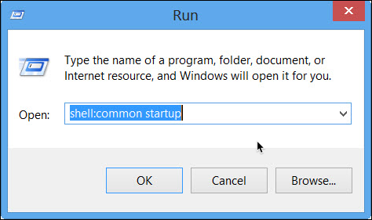

title: Windows Guides and How-To
description: Windows Guides and How-To, examples and simple usage

# Windows Guides and How-To

## Auto Login Without Password at Boot

Hit WIN+R or from start menu search `run` and press enter.  
At run dialog enter `netplwiz`:


* In the User Accounts dialog box, click the account you want to automatically log on to.If it is available, clear the Users Must Enter A User Name And Password To Use This Computer check box.
* Click OK.
* In the Automatically Log On dialog box, enter the user’s password twice and click OK.



The next time you restart the computer, it will automatically log on with the local user account you selected. Configuring automatic logon stores the user’s password in the registry unencrypted, where someone might be able to retrieve it.

## Add Program to Startup - Windows 7,8,10 & Servers

Hit WIN+R or from start menu search `run` and press enter.  
At run dialog enter `shell:common startup`:



* Create shortcut for the program you want to auto startup when Windows boots.
* Move the shortcut to the `Startup` folder that opened before.

## Reboot or Shutdown Windows From Command Line (CMD)

Reboot windows computer
This command will set a time out of 10 seconds to close the applications. After 10 seconds, windows reboot will start.

```cmd
shutdown /r /t 10
```

Force reboot

```cmd
shutdown /r /f /t 0
```

Force Shutdown

```cmd
shutdown /s /f /t 0
```

<!-- Donation Button -->
<form action="https://www.paypal.com/cgi-bin/webscr" method="post" target="_top" align="center"><input type="hidden" name="cmd" value="_s-xclick"><input type="hidden" name="hosted_button_id" value="Q94AU5RUD4X6A"><input type="image" src="https://raw.githubusercontent.com/fire1ce/3os.org/gh-pages/assets/images/beerDonation.png" width="220px" border="0" name="submit" alt="PayPal - The safer, easier way to pay online!"></form>
<!-- Donation Button -->